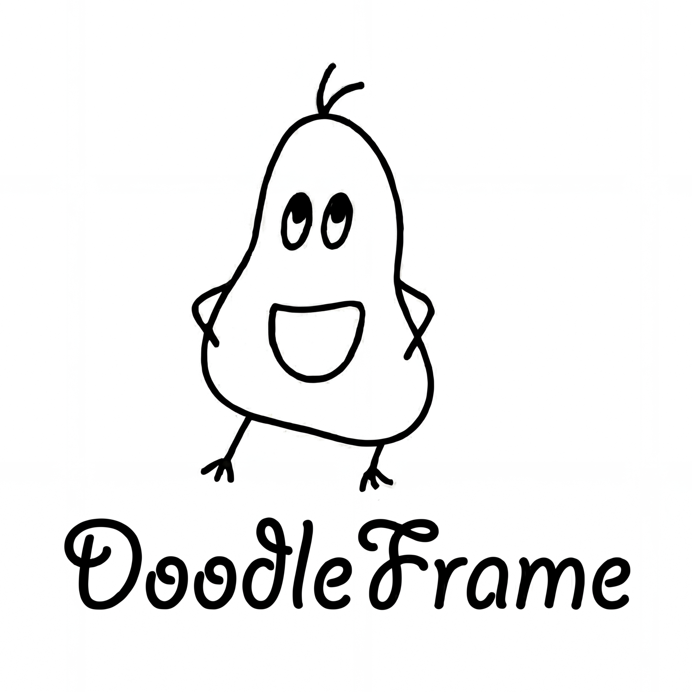

# DoodleFrame 🎨

A free, open-source drawing and wireframing tool with **intelligent screenshot object detection**.

Turn any screenshot into an editable wireframe with one click using OpenCV-powered object recognition.

Repository: https://github.com/DefiDevChris/DoodleFrame.git

<p align="center">
  
</p>

## Features

- 🎯 **Smart Object Detection** *(Unique!)* - Import screenshots and automatically detect UI elements (buttons, cards, panels) using OpenCV computer vision. Adjustable sensitivity slider for precise control.
- ✏️ **Drawing Tools** - Pen, marker, arrow, rectangle, circle, text, eraser
- 📐 **Wireframing Templates** - Phone, browser, and tablet device frames
- 🔗 **Grouping & Organization** - Group objects with Ctrl+G, ungroup with Ctrl+Shift+G
- 🔍 **Zoom & Pan** - Navigate large canvases with mouse wheel and hand tool
- #️⃣ **Grid & Snap** - Optional grid with snap-to-grid for precise alignment
- 🔒 **Lock Objects** - Prevent accidental changes to finalized elements
- 💾 **Export & Save** - Export as PNG, save/load project files (.doodleframe)
- ↩️ **Undo/Redo** - Full history with unlimited undo/redo

## Installation

### Flatpak (Recommended)
```bash
flatpak install flathub com.doodleframe.DoodleFrame
```

### AppImage
```bash
chmod +x DoodleFrame-x86_64.AppImage
./DoodleFrame-x86_64.AppImage
```

### Build from Source
```bash
npm install
npm run electron:build:linux
```

## Shortcuts

| Key | Action |
|-----|--------|
| Ctrl+Z | Undo |
| Ctrl+Shift+Z | Redo |
| Ctrl+G | Group selected |
| Ctrl+Shift+G | Ungroup |
| Delete | Delete selected |

## Development

```bash
npm install
npm run electron:dev    # Dev mode
npm test                # Run tests
npm run build           # Production build
```

## Tech Stack

- React 19 + TypeScript
- Konva.js + react-konva for canvas rendering
- OpenCV.js for object detection
- Vite
- Tailwind CSS
- Electron for desktop app

## License

MIT
